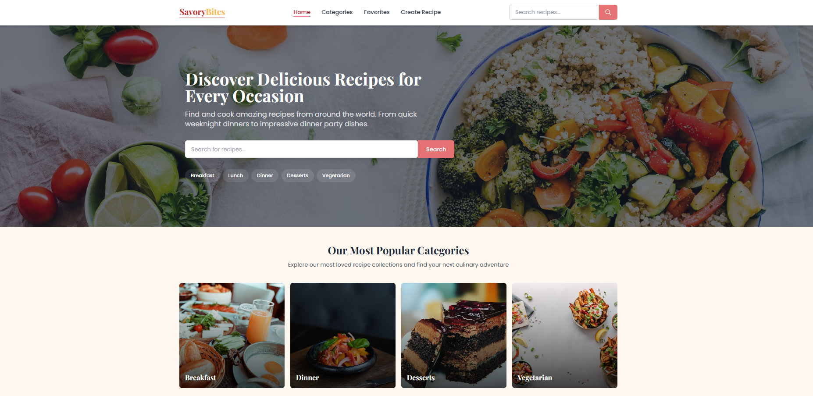
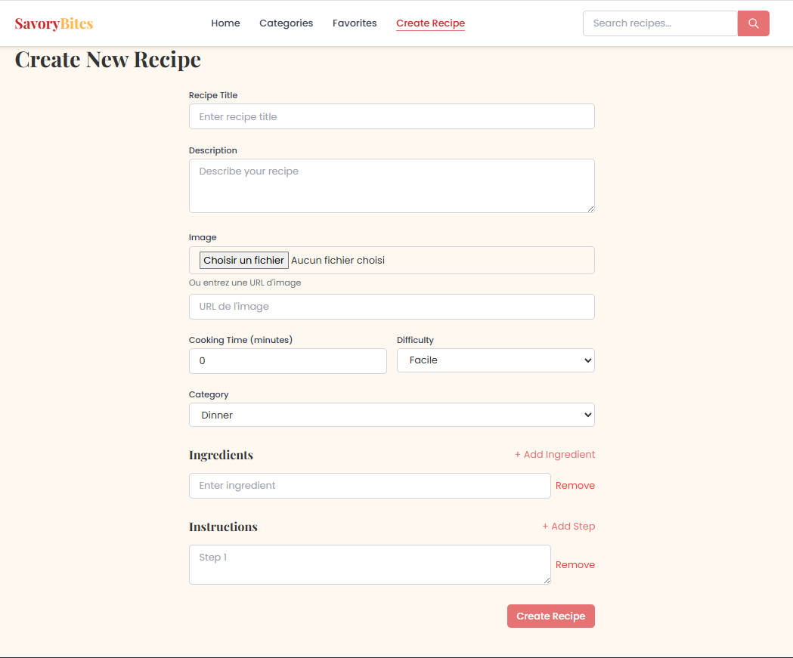
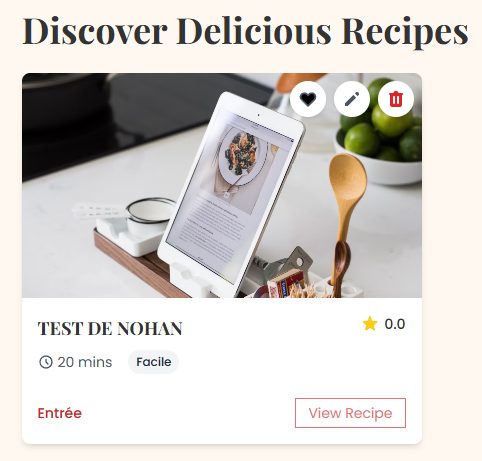
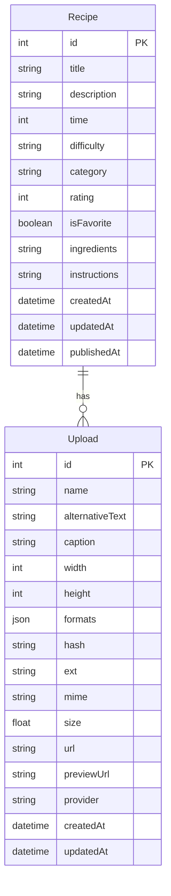
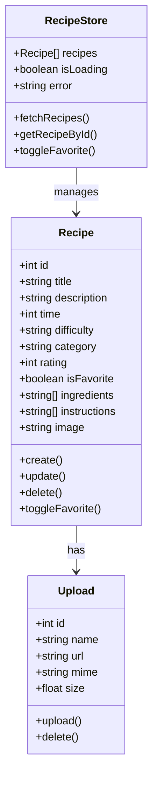
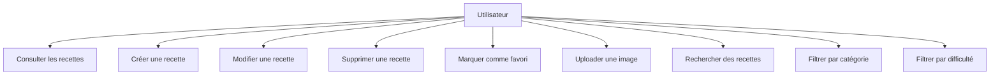
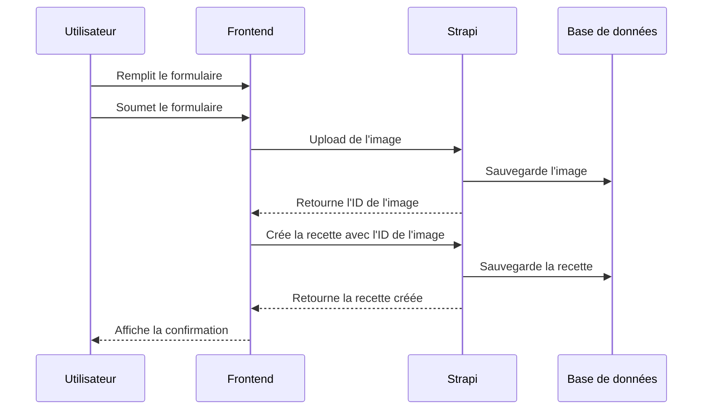

# Application de Recettes de Cuisine

## lancer le projet
Pour lancer le projet, suivez les étapes ci-dessous :

1. **Clonez le dépôt** :
   ```bash
   git clone https://github.com/nohan-lebreton/strapi-recipe-app.git
   ```
2. **Installez les dépendances** :
   - Pour le backend (Strapi) :
     ```bash
     cd backend
     npm install
     ```
   - Pour le frontend (Vue.js) :
     ```bash
     cd frontend
     npm install
     ```
3. **Démarrez le backend** :
   ```bash
   cd backend
   npm run develop
   ```
4. **Démarrez le frontend** :
   ```bash
   cd frontend
   npm run serve
   ```
5. **Mettre à jour les droits d'accès** :
    Sans export de la base de données, vous devez configurer les permissions manuellement dans Strapi :
   - Accédez à l'interface d'administration de Strapi (généralement à `http://localhost:1337/admin`). L'url est fournit par Strapi lors du démarrage.
   - Créez un utilisateur administrateur si ce n'est pas déjà fait.
   - Allez dans "Settings" > "Roles & Permissions".
   - Sélectionnez le rôle "Public" et "Authenticated".
   - Activez toutes les permissions nécessaires pour les recettes (CRUD). Et les uploads.

6. **Accédez à l'application** :
    - Ouvrez votre navigateur et allez à l'URL spécifiée pour le frontend lors du lancement.

## Documentation Utilisateurs



*Page d'accueil de l'application SavoryBites : recherche, navigation par catégories, et accès rapide aux recettes populaires.*



*Formulaire de création d'une nouvelle recette : saisie des informations, ajout d'ingrédients, d'instructions et gestion de l'image.*



*Carte d'un recette.*
- Si on clique (en bas à droite de la carte) sur view recipe on peut voir les details de la recette.
- Si on clique sur l'icon poubelle on suprrime la recette (pas simplement front mais directement en bdd)
- Si on clique sur l'icon crayon on ouvre une fenetre d'edition de la recette.
- Si on clique sur l'icon de coeur on met la recette en favoris. Ce qui permet de la voir dans l'onglet "favorites".

## Spécifications Générales

### Schéma Relationnel



### Diagramme UML

#### Diagramme de Classes



#### Diagramme de Cas d'Utilisation



#### Diagramme de Séquence - Création d'une Recette



### Routes API

#### Backend (Strapi)

| Méthode | Route | Description |
|---------|-------|-------------|
| GET | `/api/recipes` | Récupérer toutes les recettes |
| GET | `/api/recipes/:id` | Récupérer une recette spécifique |
| POST | `/api/recipes` | Créer une nouvelle recette |
| PUT | `/api/recipes/:id` | Mettre à jour une recette |
| DELETE | `/api/recipes/:id` | Supprimer une recette |
| POST | `/api/upload` | Uploader une image |

#### Frontend (Vue.js)

| Route | Composant | Description |
|-------|-----------|-------------|
| `/` | `HomePage.vue` | Page d'accueil avec la liste des recettes |
| `/create` | `CreateRecipe.vue` | Formulaire de création de recette |
| `/recipe/:id` | `RecipeDetail.vue` | Détails d'une recette spécifique |

### Structure des Données

#### Recipe
```